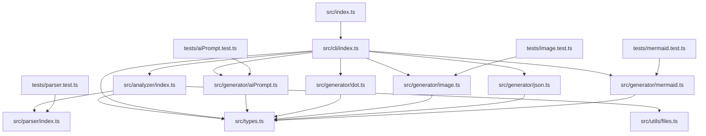

```mermaid
graph TD
  module_src_analyzer_index["src/analyzer/index.ts"]
  module_src_cli_index["src/cli/index.ts"]
  module_src_generator_aiPrompt["src/generator/aiPrompt.ts"]
  module_src_generator_dot["src/generator/dot.ts"]
  module_src_generator_image["src/generator/image.ts"]
  module_src_generator_json["src/generator/json.ts"]
  module_src_generator_mermaid["src/generator/mermaid.ts"]
  module_src_index["src/index.ts"]
  module_src_parser_index["src/parser/index.ts"]
  module_src_types["src/types.ts"]
  module_src_utils_files["src/utils/files.ts"]
  module_tests_aiPrompt_test["tests/aiPrompt.test.ts"]
  module_tests_image_test["tests/image.test.ts"]
  module_tests_mermaid_test["tests/mermaid.test.ts"]
  module_tests_parser_test["tests/parser.test.ts"]
  module_src_analyzer_index --> module_src_parser_index
  module_src_analyzer_index --> module_src_types
  module_src_analyzer_index --> module_src_utils_files
  module_src_cli_index --> module_src_analyzer_index
  module_src_cli_index --> module_src_generator_aiPrompt
  module_src_cli_index --> module_src_generator_dot
  module_src_cli_index --> module_src_generator_image
  module_src_cli_index --> module_src_generator_json
  module_src_cli_index --> module_src_generator_mermaid
  module_src_cli_index --> module_src_types
  module_src_generator_aiPrompt --> module_src_types
  module_src_generator_dot --> module_src_types
  module_src_generator_image --> module_src_types
  module_src_generator_json --> module_src_types
  module_src_generator_mermaid --> module_src_types
  module_src_index --> module_src_cli_index
  module_tests_aiPrompt_test --> module_src_generator_aiPrompt
  module_tests_image_test --> module_src_generator_image
  module_tests_mermaid_test --> module_src_generator_mermaid
  module_tests_parser_test --> module_src_parser_index
```
